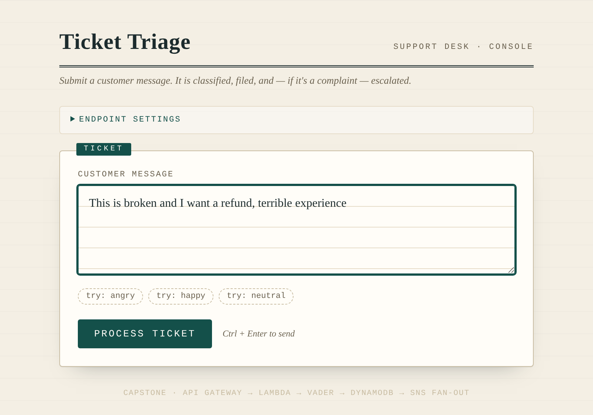
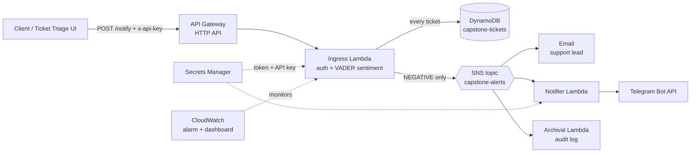

# Inbound Text Classifier & Alerting Service

**A serverless AWS pipeline that reads incoming support tickets, scores their sentiment, stores each one, and alerts the support team on email and Telegram within seconds when a customer is unhappy.**


Capstone project for the Cloud Solutions course, M.Sc. Computer Science (Cybersecurity), SRH University (2026)

**Team:** Yamini Ravi & Meenakshy Kattungal Roshan

   🔗 **UI demo:** https://yaminiravi07.github.io/Capstone_Inbound-Text-Classifier/

   > **Note:** The backend (API Gateway, Lambda, DynamoDB, SNS) was deployed in an AWS Academy Learner Lab, which has since been shut down. The page loads, but submitting a ticket won't return a result. To run the full pipeline, deploy it yourself with the steps under [Deploy it yourself](#deploy-it-yourself).

   

---

## The problem

Support teams receive many messages a day, and the angry ones get buried among the routine ones. This service reads every incoming message automatically, keeps a permanent record, and alerts people right away when a complaint comes in. Nobody has to watch the inbox.

## Architecture



### Request flow

1. **API Gateway** exposes `POST /notify`. A request without the correct `x-api-key` header gets **HTTP 403**.
2. **Ingress Lambda** validates the request body and scores sentiment in-process with **VADER** (compound ≤ −0.05 → NEGATIVE, ≥ 0.05 → POSITIVE, otherwise NEUTRAL).
3. **Every** ticket is written to **DynamoDB** (on-demand billing) as the permanent record.
4. **Negative** tickets are published to **SNS**, which sends them to three consumers:
   - **Email** to the support lead
   - **Telegram notifier Lambda**, which delivers the alert to a chat through the external Telegram Bot API
   - **Archival Lambda**, which writes an audit log entry
5. The Telegram token and the API key live only in **AWS Secrets Manager** and are read at runtime.
6. **CloudWatch** provides an error alarm and a dashboard of invocations, errors and duration.

## Tech stack

| Layer                | Choice                                     |
|----------------------|--------------------------------------------|
| Infrastructure as Code | Terraform (AWS provider 5.x)             |
| Compute              | AWS Lambda × 3 (Python 3.12)               |
| Public ingress       | Amazon API Gateway (HTTP API)              |
| NLP                  | VADER sentiment, bundled into the Lambda   |
| Storage              | Amazon DynamoDB (PAY_PER_REQUEST)          |
| Event fan-out        | Amazon SNS                                 |
| External integration | Telegram Bot API                           |
| Secrets              | AWS Secrets Manager                        |
| Observability        | Amazon CloudWatch (alarm + dashboard)      |
| Frontend             | Single-file HTML/JS "Ticket Triage" UI     |

## Engineering decisions & challenges

We built this in a restricted AWS Academy Learner Lab, so several design choices came from working around its limits.

- **Amazon Comprehend was blocked → switched to VADER.** The lab role has no `comprehend:*` permissions (AccessDeniedException). We moved sentiment scoring into the Lambda itself with VADER. It needs no extra IAM permissions, costs nothing per call, and adds no network hop.
- **No IAM role creation.** The lab denies `iam:CreateRole`, so Terraform uses a data source to reference the existing `LabRole` instead of creating roles.
- **SNS fan-out instead of chained calls.** The ingress Lambda publishes once, and each consumer is independent, so new alert channels can be added without touching the ingress code.
- **Secrets stay out of the code.** The token and API key are set from the command line into Secrets Manager. Nothing sensitive is committed.
- **Alarm tuned for an idle service.** `treat_missing_data = "notBreaching"` stops the alarm firing during quiet periods.
- **State conflicts between lab sessions.** Lab sessions reset, but some resources survive. We resolved a leftover DynamoDB table with `terraform import` (see below).

## Project structure

```
main.tf                   All infrastructure (Terraform)
src/handler.py            Ingress Lambda: auth, VADER, DynamoDB write, SNS publish
src_notifier/handler.py   Telegram notifier Lambda (SNS consumer)
src_archival/handler.py   Archival Lambda (SNS consumer)
ticket-triage.html        Browser UI for submitting and viewing ticket results
```

## Deploy it yourself

**Prerequisites:** an AWS account or Learner Lab (us-east-1), Terraform, the AWS CLI, Python 3.12.

> Outside the Learner Lab, replace the `LabRole` data source with your own Lambda execution role, and change the email address in `aws_sns_topic_subscription.email`.

1. **Bundle VADER into `src/`** (a dependency, not committed):

   ```bash
   pip install vaderSentiment -t src/
   ```

2. **Deploy:**

   ```bash
   terraform init
   terraform apply
   ```

   If you get `ResourceInUseException: Table already exists: capstone-tickets`:

   ```bash
   terraform import aws_dynamodb_table.tickets capstone-tickets
   terraform apply
   ```

3. **Store the secrets** (never in code):

   ```bash
   aws secretsmanager put-secret-value \
     --secret-id capstone/phase2/telegram \
     --secret-string '{"telegram_token":"YOUR_TOKEN","chat_id":"YOUR_CHAT_ID","api_key":"YOUR_API_KEY"}' \
     --region us-east-1
   ```

4. **Confirm the email subscription** using the link AWS sends you.

5. **Get the endpoint:** `terraform output invoke_url`

## Test it

```bash
# Negative → stored + email + Telegram + archive
curl -X POST -H "x-api-key: YOUR_API_KEY" -H "Content-Type: application/json" \
  -d '{"text":"This is broken and I want a refund, terrible experience"}' "INVOKE_URL"
# {"sentiment":"NEGATIVE","stored":true,"published_to_sns":true, ...}

# Positive → stored only
curl -X POST -H "x-api-key: YOUR_API_KEY" -H "Content-Type: application/json" \
  -d '{"text":"Amazing product, I love it!"}' "INVOKE_URL"
# {"sentiment":"POSITIVE","published_to_sns":false, ...}

# No key → 403
curl -i -X POST -H "Content-Type: application/json" -d '{"text":"hi"}' "INVOKE_URL"
```

Inspect results:

```bash
aws dynamodb scan --table-name capstone-tickets --region us-east-1
aws logs tail /aws/lambda/capstone-archival-fn --region us-east-1 --since 10m
```

**Tear down:** `terraform destroy`

## What I'd improve next

- Replace VADER with a transformer model (e.g. DistilBERT on SageMaker or a Lambda container) to catch sarcasm and handle multiple languages
- Add topic classification (billing, bug, delivery) next to sentiment, so alerts reach the right team
- A GitHub Actions pipeline: `terraform fmt`/`validate`, `tflint`, `checkov` security scan, and unit tests for the handlers
- Move the API key check to an API Gateway Lambda authorizer and add rate limiting
- Add an SQS dead-letter queue for failed Telegram deliveries

## Security notes

No credentials are in this repository. Do not commit `.terraform/`, `terraform.tfstate*`, `build/`, or the bundled `src/vaderSentiment/` folder (all in `.gitignore`).

🔗 **UI demo:** https://yaminiravi07.github.io/Capstone_Inbound-Text-Classifier/ticket-triage.html

> **Note:** The backend (API Gateway, Lambda, DynamoDB, SNS) was deployed in an AWS Academy Learner Lab, which has since been shut down. The page loads, but submitting a ticket won't return a result. To run the full pipeline, deploy it yourself with the steps under [Deploy it yourself](#deploy-it-yourself).
